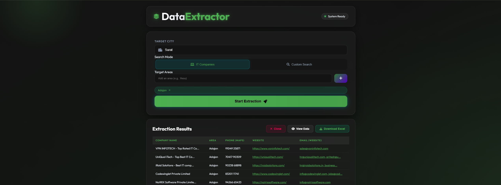
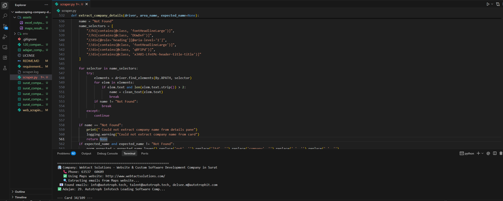
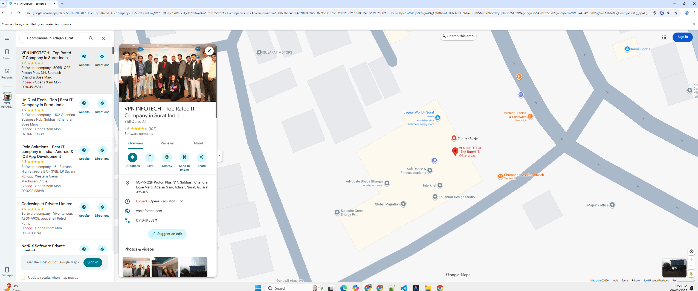
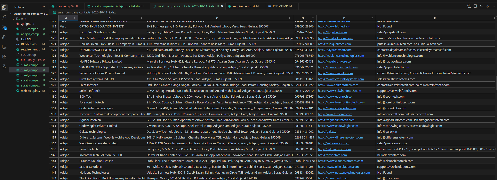

# 🚀 Google Maps Business Data Scraper

> **Advanced hybrid web scraping system** for extracting comprehensive business data from Google Maps with intelligent email discovery, CloudFlare bypass, and parallel processing.

[](https://www.python.org/)
[](https://www.selenium.dev/)
[](LICENSE)

---

## 📸 Project Screenshots

### 🖥️ Web Interface Dashboard

*Interactive web UI showing extraction results with company data table*

### ⚡ Live Scraping Progress

*Real-time scraping progress with live logs and status updates*



### Google Maps Scraping


### Excel Output


---

## 📌 What It Does

This production-ready scraper automatically extracts **complete business contact information** from Google Maps based on location and category.

### Data Extracted:
- ✅ **Company Name** - Validated and cleaned
- ✅ **Complete Address** - Symbol-cleaned and formatted
- ✅ **Phone Numbers** - Multiple formats supported
- ✅ **Official Website** - With social media filtering
- ✅ **Email Addresses** - Multi-source extraction with CloudFlare bypass

---

## 🎯 Key Features

### 🔥 Advanced Email Extraction
- **Multi-layer Email Discovery:**
  - Regex pattern matching on website source
  - CloudFlare protected email decoding
  - `mailto:` link extraction
  - **NEW:** Intelligent button navigation (Company → About Us → Contact Us)
  - JavaScript-rendered content extraction via Selenium
  - Email caching to avoid redundant scraping

### 🌐 Smart Website Discovery
When Google Maps doesn't provide a website:
- Automatic domain generation from company name
- TLD permutation strategy (.com, .in, .co.in, .net, etc.)
- Live domain validation
- Social media & generic platform filtering

### ⚡ Parallel Processing Architecture
- Multiple browser instances running simultaneously
- ThreadPoolExecutor for network requests
- Configurable concurrency levels
- Optimized for speed without overwhelming servers

### 🛡️ Anti-Detection Mechanisms
- Randomized user agents
- Incognito mode sessions
- Human-like scrolling patterns
- WebDriver property obfuscation
- Request rate limiting

### 🧹 Data Quality Pipeline
- Unicode symbol removal from addresses
- Plus Code filtering
- Business name normalization
- Duplicate detection and removal
- Non-business entity filtering (parks, government offices, etc.)

---

## 🏗️ Architecture Highlights

```
┌─────────────────────────────────────────────────────────┐
│                   Google Maps Scraper                    │
├─────────────────────────────────────────────────────────┤
│                                                           │
│  1. Maps Data Extraction (Selenium)                      │
│     • Dynamic scrolling & card loading                   │
│     • Name, Phone, Address extraction                    │
│     • Website link capture                               │
│                                                           │
│  2. Website Discovery (Fallback Engine)                  │
│     • Domain generation                                  │
│     • Live validation (Requests)                         │
│     • Social media filtering                             │
│                                                           │
│  3. Email Extraction (Hybrid)                            │
│     • Homepage scraping (Requests + BeautifulSoup)       │
│     • Contact page navigation (Selenium)                 │
│     • Button clicking logic (Company/About/Contact)      │
│     • CloudFlare email decoding                          │
│     • Result caching                                     │
│                                                           │
│  4. Data Processing                                      │
│     • Text cleaning & normalization                      │
│     • Deduplication                                      │
│     • Excel export with auto-sizing                      │
│                                                           │
└─────────────────────────────────────────────────────────┘
```

---

## ⚙️ Tech Stack

| Technology | Purpose |
|------------|---------|
| **Python 3.8+** | Core language |
| **Selenium** | Browser automation |
| **Requests** | HTTP requests |
| **BeautifulSoup** | HTML parsing |
| **Pandas** | Data manipulation |
| **openpyxl** | Excel file generation |
| **ThreadPoolExecutor** | Parallel processing |
| **WebDriver Manager** | Automatic driver management |

---

## 📦 Installation

### Prerequisites
- Python 3.8 or higher
- Google Chrome browser

### Setup

```bash
# Clone the repository
git clone https://github.com/Sanketmajithiya/google-maps-business-scraper.git

# Navigate to project directory
cd google-maps-business-scraper

# Install dependencies
pip install -r requirements.txt
```

---

## ▶️ Usage

### Basic Run
```bash
python scraper.py
```

### Configuration
Edit the `CONFIG` dictionary in `scraper.py`:

```python
CONFIG = {
    "AREAS": ["Adajan", "Vesu", "Athwa"],  # Areas to scrape
    "SEARCH_QUERY_TEMPLATE": "IT companies in {area} surat",
    "TARGET_PER_AREA_MIN": 120,  # Minimum companies per area
    "TARGET_PER_AREA_MAX": 120,  # Maximum companies per area
    "MAX_THREADS": 20,           # Network request concurrency
    "REQUEST_TIMEOUT": 8,         # Request timeout in seconds
    "HEADLESS": True,             # Run browser in headless mode
    "BROWSER_INSTANCES": 2        # Parallel browser instances
}
```

### Web Interface (Optional)
```bash
python app.py
```
Then open `http://localhost:5000` in your browser.

---

## 📊 Output

### Excel File
Generated as: `Surat_data_YYYY-MM-DD_HH-MM.xlsx`

**Columns:**
- Area
- Company Name
- Address
- Phone (Maps)
- Website
- Email (Website)

### Log File
Detailed execution logs saved to `scraper.log`

---

## 🧪 Engineering Concepts Demonstrated

This project showcases professional-level implementation of:

- ✅ **Web Automation Engineering** - Complex Selenium workflows
- ✅ **Parallel Processing** - ThreadPoolExecutor optimization
- ✅ **Fallback Strategies** - Multi-layer data extraction
- ✅ **Data Validation** - Robust cleaning pipelines
- ✅ **Error Handling** - Graceful degradation
- ✅ **Anti-Detection** - Browser fingerprint obfuscation
- ✅ **Caching Mechanisms** - Performance optimization
- ✅ **Production Logging** - Comprehensive debugging support

---

## 🔧 Advanced Features

### Email Extraction Enhancements

**Button Navigation Logic:**
```python
# Automatically clicks and extracts emails from:
- Company dropdown menu
- About Us page
- Contact Us page
- Multiple page sources combined
```

**CloudFlare Email Decoding:**
```python
# Decodes protected emails like:
/cdn-cgi/l/email-protection#[encoded_string]
```

**Smart Email Filtering:**
- Filters out template/junk emails (bootstrap@, example@, etc.)
- Validates domain structure
- Removes image file emails

---

## 📁 Project Structure

```
google-maps-business-scraper/
│
├── scraper.py              # Main scraping logic
├── app.py                  # Flask web interface (optional)
├── requirements.txt        # Python dependencies
├── run.bat                 # Windows batch script
├── LICENSE                 # MIT License
├── README.md               # This file
│
├── templates/              # Web interface templates
│   └── index.html
│
├── static/                 # Static assets
│   ├── css/
│   └── js/
│
└── assets/                 # Screenshots for README
    └── *.png
```

---

## ⚠️ Disclaimer

**This project is intended for educational and research purposes only.**

- Always respect website Terms of Service
- Follow legal guidelines for web scraping in your jurisdiction
- Implement rate limiting to avoid server overload
- Use responsibly and ethically

---

## 🤝 Contributing

Contributions are welcome! Please feel free to submit a Pull Request.

---

## 📄 License

This project is licensed under the MIT License - see the [LICENSE](LICENSE) file for details.

---

## 👨‍💻 Author

**Majithiya Sanket Prashantbhai**

Full Stack Python Developer | Web Scraping Engineer

[](https://github.com/Sanketmajithiya)

---

## ⭐ Interview-Ready Features

This project demonstrates:

- ✅ **Advanced Selenium Usage** - Dynamic content handling, anti-detection
- ✅ **Scalable Architecture** - Parallel processing, thread management
- ✅ **Clean Code Structure** - Modular functions, proper naming conventions
- ✅ **Production Design** - Logging, error handling, data validation
- ✅ **Performance Optimization** - Caching, concurrent execution
- ✅ **Real-World Problem Solving** - Fallback strategies, CloudFlare bypass

---

## 🚀 Future Enhancements

- [ ] Database integration (PostgreSQL/MongoDB)
- [ ] API endpoint for remote scraping
- [ ] Docker containerization
- [ ] Proxy rotation support
- [ ] CSV export option
- [ ] Real-time progress dashboard

---

**Made with ❤️ by Sanket Majithiya**
